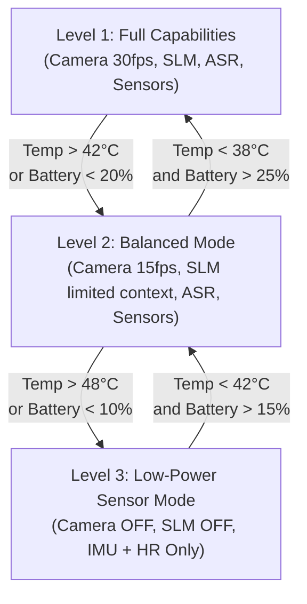

# FitOS Engineering Rules & Quality Standards

This document establishes the strict performance, hardware, security, and fallback contracts that FitOS must respect to operate autonomously and efficiently on edge devices.

---

## 1. System Memory & Model Budgets

Because FitOS runs alongside user applications on mobile or wearable hardware, it must not exceed its allocated memory footprint. Exceeding budgets triggers operating system out-of-memory (OOM) processes.

| Component | Model Description | Precision / Quantization | Storage Budget | Active RAM Budget | Processing Unit |
| :--- | :--- | :--- | :--- | :--- | :--- |
| **Pose CV** | MediaPipe Pose Heavy / YOLOv8-pose | INT8 | `< 30 MB` | `< 80 MB` | Local NPU (e.g. Apple ANE, Snapdragon NPU) |
| **Local SLM** | Qwen-2.5-3B-Instruct or Llama-3-8B | 4-bit (GGUF / AWQ) | `< 2.0 GB` | `< 2.3 GB` (2k context) | NPU / GPU |
| **Local ASR** | Whisper-Tiny-EN | INT8 / FP16 | `< 75 MB` | `< 120 MB` | GPU / CPU |
| **Local TTS** | Piper TTS (Medium Voice) | FP32 | `< 25 MB` | `< 50 MB` | CPU |
| **Core OS & DB**| SQLite + C++ Host Engine | N/A | `< 10 MB` | `< 60 MB` | CPU |
| **Total System** | **Entire FitOS Suite** | **Optimized Mixed** | **< 2.15 GB** | **< 2.61 GB** | **NPU/GPU/CPU Shared** |

*Rule*: At no point shall the active memory footprint of the system exceed **2.8 GB** on mobile configurations, or **500 MB** on wearable standalone configurations (where CV/SLM are offloaded or disabled).

---

## 2. Latency Budgets (Budget-Driven Architecture)

To maintain a seamless personal trainer experience, time elapsed between a physical error and corrective feedback must not exceed human reaction time.

```
                  ┌────────────────────── Latency Budget (100ms) ──────────────────────┐
                  │                                                                   │
[Frame Ingestion] ┼──> [CV Landmark Inference] ──> [Angle Analysis] ──> [Haptic Alert] ┼
      2ms                  30ms (NPU)                  15ms                15ms
```

### 2.1 Real-Time Pose Loop (Target: < 100ms)
*   **Sensor/Frame Capture to Buffer**: $\le 5\text{ms}$
*   **Landmark Inference (NPU)**: $\le 33\text{ms}$ (ensures lock at 30 FPS)
*   **Biomechanical Rule Processing**: $\le 15\text{ms}$
*   **Haptic Trigger Dispatch**: $\le 10\text{ms}$
*   **UI Landmark Repaint**: $\le 33\text{ms}$
*   *Maximum Allowable Total Pose-to-Feedback Latency*: **100ms**

### 2.2 Speech & Conversation Loop (Target: < 1500ms)
*   **Voice Activity Detection (VAD) Trigger**: $\le 100\text{ms}$
*   **Audio Transcription (ASR)**: $\le 300\text{ms}$
*   **RAG Document Search & Prompt Assembly**: $\le 50\text{ms}$
*   **SLM Time-to-First-Token (TTFT)**: $\le 750\text{ms}$
*   **TTS Voice Generation**: $\le 200\text{ms}$
*   *Maximum Allowable User Voice-to-Response Latency*: **1500ms**

---

## 3. Privacy & Security Constraints

As an offline system storing highly sensitive biometric data, FitOS adheres to a zero-trust, edge-confined security boundary.

*   **Strict Isolation**: The compilation manifest must exclude all network sockets (`AF_INET`, `AF_INET6`) from the runtime profile, preventing outbound packets.
*   **Database Encryption**: The local SQLite database must be encrypted using 256-bit AES via **SQLCipher**. The decryption key must reside in the secure enclave of the host operating system (Apple Keychain / Android Keystore).
*   **Biometric Data Sanitization**: If logs must be exported for manual debugging, all raw video files, audio recordings, and raw sensor logs must be deleted or masked. Only aggregated statistics (e.g., total rep counts, active duration) may be packaged.
*   **Weight Verification**: On boot, the system hashes the local model weights (Pose, SLM, ASR) and matches them against a hardcoded SHA256 list to prevent local tampering or prompt injection overlays.

---

## 4. Graceful Degradation Levels (Power & Thermal Management)

FitOS monitors the host device's battery charge, thermal state, and processor throttle indicators. It dynamically transitions between three operational levels:



### 4.1 Level 1: Full Capability
*   **Conditions**: Battery $\ge 20\%$, Temperature normal.
*   **Operation**: Camera running at 30 FPS, Pose detection fully active, local SLM loaded with 2,048 token context window, dynamic audio and haptic feedback enabled.

### 4.2 Level 2: Balanced Mode (Battery Conservation)
*   **Conditions**: Battery $< 20\%$, or device thermal throttling warning.
*   **Operation**:
    *   Reduce camera ingestion to 15 FPS (skipping alternate frames).
    *   Compress the SLM context window to 512 tokens.
    *   Haptic motor intensity reduced by 30% to conserve battery.
    *   Skip real-time vector embedding updates (queue updates for standby).

### 4.3 Level 3: Low-Power Sensor Mode (Critical Fallback)
*   **Conditions**: Battery $< 10\%$, or device thermal status at critical hazard ($\ge 48^\circ\text{C}$).
*   **Operation**:
    *   **Disable Camera**: Power down camera stream and close the Pose CV inference session to release NPU/GPU resources.
    *   **Unload SLM**: Evict the SLM from active RAM, freeing up ~2GB of system memory.
    *   **Sensor-Only Core**: Track exercise sets and repetitions using wearable IMU frequency signatures and threshold matching.
    *   **Heuristic Feedback**: Form analysis falls back to basic accelerometer/gyroscope posture checks. Voice interaction is suspended; feedback is delivered only via haptic signals.
