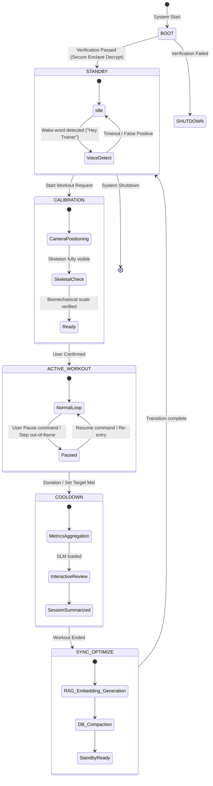

# FitOS System Lifecycle & State Machine

This document details the operational phases of **FitOS**, detailing how the system transitions between different states, manages dynamic sensor polling rates, and handles memory-swapping strategies for edge AI weights.

---

## 1. System State Machine

FitOS transitions through discrete state configurations to minimize active power consumption while maintaining immediate user responsiveness.



---

## 2. State Mapping Details

### 2.1 Boot/Init State (`BOOT`)
*   **Actions**:
    1. Retrieve database encryption key from Secure Enclave.
    2. Open SQLite / SQLCipher metrics database.
    3. Perform SHA256 checksum verify on local AI weight files (`pose.onnx`, `slm_qwen3b_q4.gguf`, `whisper_tiny.bin`).
    4. Enforce security validation check. If corrupt, flag error and halt.

### 2.2 Standby State (`STANDBY`)
*   **Actions**: 
    *   Monitor microphone stream using a ultra-low-power local Voice Activity Detection (VAD) node.
    *   Sensor ingestion (Camera, IMUs, GPS) is suspended. Heart rate sensor is polled in low-frequency mode (once every 5 minutes).
    *   Core AI engines are evicted from memory to preserve system RAM.

### 2.3 Calibration State (`CALIBRATION`)
*   **Actions**:
    *   Initiate camera stream capture at 30 FPS.
    *   Instruct user via haptics/audio to stand 2.5 meters away from the camera.
    *   Verify the visibility tracker has acquired all 33 pose joints.
    *   Calibrate skeletal limb lengths (femur, tibia, humerus) to determine user anthropometrics.

### 2.4 Active Workout State (`ACTIVE_WORKOUT`)
*   **Actions**:
    *   Ingest wearable IMU stream at 50Hz and PPG heart rate at 1Hz.
    *   Process visual frames through the Pose CV engine on the NPU.
    *   Evaluate joint angles against the target exercises rule-set.
    *   Trigger low-latency feedback actuators when form deviations are detected.
    *   Append telemetry lines to the local DB.

### 2.5 Cooldown & Reflection State (`COOLDOWN`)
*   **Actions**:
    *   Turn off camera and release NPU resources.
    *   Aggregate workout logs into set-by-set statistics (reps completed, average tempo, form consistency).
    *   Load the Small Language Model (SLM) into GPU/CPU RAM.
    *   Run conversational synthesis: allow user to converse with the trainer ("How did my form look today?", "My right knee hurt, what should I modify next time?").

### 2.6 Sync & Optimize State (`SYNC_OPTIMIZE`)
*   **Actions**:
    *   Unload SLM and Whisper weights.
    *   Translate text reflections from the workout session into 384-dimensional embeddings (using ONNX MiniLM). Insert embeddings into `user_context_embeddings` table.
    *   Execute database compaction (`VACUUM` and log compression) to prevent local storage bloat.
    *   Clear temporary frames and audio buffers.

---

## 3. Memory Swapping Strategy (Edge AI Model Loading)

Because mobile devices enforce strict active application memory limits (e.g. iOS background apps may be killed if exceeding 50-100MB, or foreground apps if exceeding 3GB), FitOS employs a strict "evict-on-state-transition" loading routine.

```
┌───────────────────┬─────────────┬─────────────┬─────────────┐
│ State             │ Pose CV     │ Whisper ASR │ Local SLM   │
├───────────────────┼─────────────┼─────────────┼─────────────┤
│ STANDBY           │ Evicted     │ Evicted     │ Evicted     │
│ CALIBRATION       │ Loaded      │ Loaded      │ Evicted     │
│ ACTIVE_WORKOUT    │ Loaded      │ Evicted     │ Evicted     │
│ COOLDOWN          │ Evicted     │ Loaded      │ Loaded      │
│ SYNC_OPTIMIZE     │ Evicted     │ Evicted     │ Evicted     │
└───────────────────┴─────────────┴─────────────┴─────────────┘
```

*   **Eviction Protocol**: When moving from `ACTIVE_WORKOUT` to `COOLDOWN`, the host memory allocator explicitly frees the tensor structures for the Pose estimation network. The system then requests allocation for the Whisper ASR model and the Qwen 3B SLM weights.
*   **Allocation Lock**: If memory allocation fails on transition due to background host constraints, FitOS skips loading the SLM and falls back to a deterministic, rule-based text summary generator.

---

## 4. Dynamic Sensor Polling Scheme

To minimize battery consumption on wearable sensors and the host device, polling rates scale relative to the active state.

| Sensor | Standby Mode | Calibration Mode | Active Workout Mode | Cooldown / Review Mode |
| :--- | :--- | :--- | :--- | :--- |
| **Camera** | Off | 30 FPS | 30 FPS (or 15 FPS in L2) | Off |
| **Wearable IMU** | Off | Off | 50 Hz | Off |
| **Heart Rate (PPG)**| 0.0033 Hz (5 min) | 1 Hz | 1 Hz (or 5 Hz for HRV) | 0.2 Hz (5 sec) |
| **Microphone** | Voice Trigger VAD | 16 kHz | Off | 16 kHz |
| **Storage Sync** | Suspended | Suspended | Write Buffer (RAM) | Flush to Disk |
